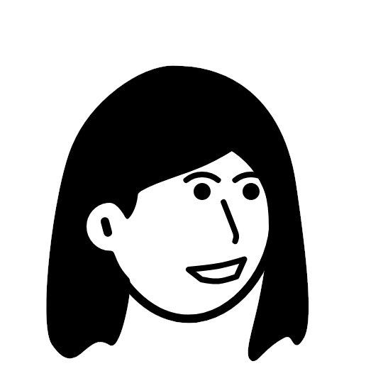
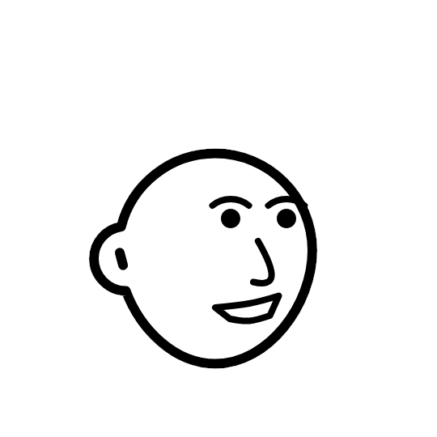
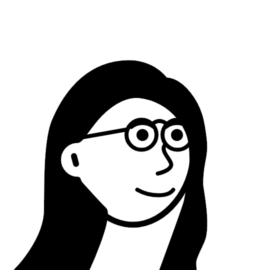
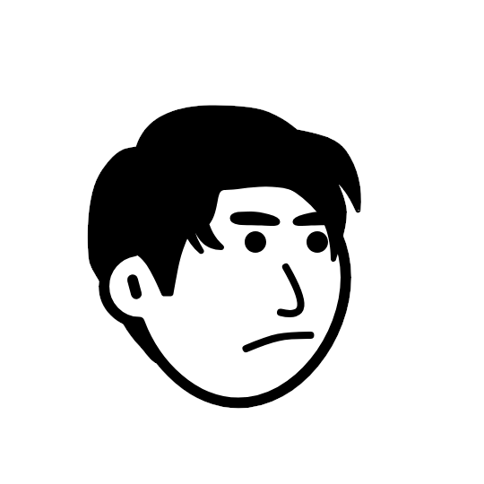

# Final Project - **Lucky 7**

멋쟁이사자처럼 프론트엔드 부트캠프 14기 파이널 프로젝트 7조입니다.

## 프로젝트 개요

- 📍 프로젝트 기간 : 2025. 09. 24 ~ 2025. 10. 28
- 📍 [배포 사이트 - Running11](https://running11.vercel.app/)

### 프로젝트 팀원

| 정윤서        | 허시온        | 이성은        | 최도형        |
| ------------ | ------------ | ------------ | ------------ |
|  |  |  |  |
| Project Leader | Project Manager | Developer   | Developer    |
| GitHub : [yoonseo23](https://github.com/yoonseo23) | GitHub : [HeoSion](https://github.com/heosion) | GitHub : [HanUL072](https://github.com/hanul072) | GitHub : [Stylechoi](https://github.com/stylechoi) |
| ENTJ            | INFP             | INTP         | ENTJ         |

### 🛠️ 기술 스택

| 분류                | 기술                                                                                                                                                                                                                                                                                                                            |
| ------------------- | ------------------------------------------------------------------------------------------------------------------------------------------------------------------------------------------------------------------------------------------------------------------------------------------------------------------------------- |
| 프론트엔드          |    |
| 백엔드              |                                                                                                                                                                                                                      |
| 패키지 매니저 |                                                                                                                                                                                                                                     |
| 협업                |               |
| 코드 품질           |                                                                                                                 |
| 디자인 & IDE        |                                                                                                                |
| 호스팅              |                                                                                                                                                                                                                            |

---
## Wiki Map
- [Home](https://github.com/FRONTENDBOOTCAMP-14th/Final-project-team7/wiki)
- [Convention](https://github.com/FRONTENDBOOTCAMP-14th/Final-project-team7/wiki/convention)
- [회의록](https://github.com/FRONTENDBOOTCAMP-14th/Final-project-team7/wiki/daily_scrum)
- [프로젝트 폴더 구조](https://github.com/FRONTENDBOOTCAMP-14th/Final-project-team7/wiki/directory_structure)
- [프로젝트 목표 및 회고](https://github.com/FRONTENDBOOTCAMP-14th/Final-project-team7/wiki/retrospect)